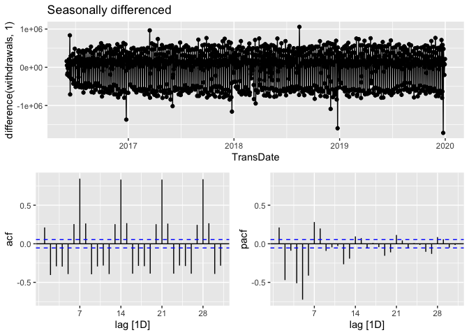
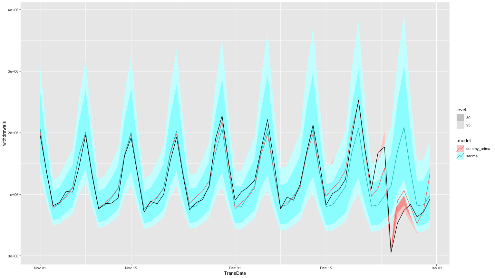

Cash Deman Forecast App
================

The code is a script in R programming language that is used to forecast
the cash demand for ATM machines. It starts by loading the required
libraries which include tidyverse, lubridate, fpp3, fable, feasts,
tsibble, tsibbledata, timeDate, stats, anomaly, anomalize, and furrr.

# CONNCETING TO SQL SERVER AND ALL STEPS

\#Intoduction:

Next, the code fills any gaps in the time series data using the
fill_gaps function from the tsibble package. The code also adds year,
month, and day columns to the tsibble. The missing values in the data
are then replaced with regression (TSLM) values using the interpolate
function.

The final part of the code deals with identifying and removing anomalies
in the data. It creates a function, named anomoly_function, that finds
anomalies in the data for each ATM. The function is then applied to all
ATMs using the map_df function. The resulting data frame with anomalous
values is named anomolies_values.

Finally, the code uses the ARIMA to fit a time series model to the data.
The resulting model is used to forecast the future cash demand for each
ATM.

# Load Data

# In this note book we Forecast cash Demand for ATM machines. We have the data for ATM machines from 01-01-2017 to 24-02-2019. the cash deman column is represented by withdrawals. We see the summary of the data below we have 17 missing values in withdrawals Column.

``` r
df<- readRDS("cash_demand.rds") 
summary(df)
```

    ##    TransDate           TerminalID             Year          Month       
    ##  Min.   :2016-06-01   Length:122789      Min.   :2016   Min.   : 1.000  
    ##  1st Qu.:2017-05-23   Class :character   1st Qu.:2017   1st Qu.: 4.000  
    ##  Median :2018-04-05   Mode  :character   Median :2018   Median : 7.000  
    ##  Mean   :2018-04-03                      Mean   :2018   Mean   : 6.901  
    ##  3rd Qu.:2019-02-16                      3rd Qu.:2019   3rd Qu.:10.000  
    ##  Max.   :2019-12-31                      Max.   :2019   Max.   :12.000  
    ##                                                                         
    ##       Day         withdrawals     transactions  
    ##  Min.   : 1.00   Min.   :   20   Min.   :  1.0  
    ##  1st Qu.: 8.00   1st Qu.: 7380   1st Qu.: 90.0  
    ##  Median :16.00   Median :11220   Median :132.0  
    ##  Mean   :15.77   Mean   :13009   Mean   :147.5  
    ##  3rd Qu.:23.00   3rd Qu.:16640   3rd Qu.:188.0  
    ##  Max.   :31.00   Max.   :72220   Max.   :719.0  
    ##                  NA's   :25

``` r
summary(is.na(df))
```

    ##  TransDate       TerminalID         Year           Month        
    ##  Mode :logical   Mode :logical   Mode :logical   Mode :logical  
    ##  FALSE:122789    FALSE:122789    FALSE:122789    FALSE:122789   
    ##                                                                 
    ##     Day          withdrawals     transactions   
    ##  Mode :logical   Mode :logical   Mode :logical  
    ##  FALSE:122789    FALSE:122764    FALSE:122789   
    ##                  TRUE :25

``` r
df$TransDate <- 
  as.Date(df$TransDate)
```

# Preprocessing

To forcast r we need to transform our dataframe to tsibble format which
id time series data format in r for formcasting. We use TransDate column
and date index and the key column as the Groups or categories that we
want to forecast.

``` r
df<-
df %>% 
    as.data.frame() %>%
  group_by(TransDate) %>%
  summarise(withdrawals = sum(withdrawals)) %>%
  tsibble(index = TransDate)


frcst_tsbl<- 
  df %>% 
  dplyr::select( 
    TransDate, withdrawals
    ) %>% 
  as_tsibble(index=TransDate)
```

# check if the time series is complete and fill the missing dates in the dataframe. Fill_gaps feature makes it easy to find out the if there is any missing date index and it fill those gaps with NA values.

``` r
#If any data for specific dates is missing, it will produce a date for it and then produce an NA value for that date.

frcst_fill_gaps<-
  fill_gaps(frcst_tsbl, .full=FALSE)

frcst_fill_gaps %>% summary()
```

    ##    TransDate           withdrawals     
    ##  Min.   :2016-06-01   Min.   :  53260  
    ##  1st Qu.:2017-04-24   1st Qu.: 884290  
    ##  Median :2018-03-17   Median :1112400  
    ##  Mean   :2018-03-17   Mean   :1223807  
    ##  3rd Qu.:2019-02-07   3rd Qu.:1548090  
    ##  Max.   :2019-12-31   Max.   :2645900  
    ##                       NA's   :24

# Next, we fill any gaps in the time series data using the fill_gaps function from the tsibble package. The code also adds year, month, and day columns to the tsibble. The missing values in the data are then replaced with regression (TSLM) values using the interpolate function.

``` r
# we need to take care of NA values in data using interpolate function in R.
# instead of mean or median we use TSLM (regression) values to replace NA values.
atms_for_forecast <- 
  frcst_fill_gaps %>% 
  model(lm= TSLM(withdrawals~ trend())) %>%
  #model(arima= ARIMA(withdrawals, stepwise = FALSE)) %>% 
  interpolate(frcst_fill_gaps)
```

``` r
final_data <-atms_for_forecast
  # atms_for_forecast %>% as.data.frame() %>%
  # group_by(TransDate) %>%
  # summarise(withdrawals = sum(withdrawals)) %>%
  # tsibble(index = TransDate)
```

## group the data by day

``` r
final_data %>% autoplot()
```

    ## Plot variable not specified, automatically selected `.vars = withdrawals`

<!-- -->

``` r
final_data %>% 
  mutate(year= year(TransDate),
         month= month(TransDate)) %>% 
  as.data.frame() %>% 
  ggplot()+
  aes(x= TransDate, y=withdrawals, col= factor(month) )+
  geom_line()+
  facet_grid (~ year, scales = "free")
```

<!-- -->

``` r
final_data %>%  
  model(
    STL(log(withdrawals) ~ 
          season(period = "day") +
          season(period = "week")+
          season(period = "month")+
          season(period = "year"),
        robust = TRUE)
  )  %>%
  components() %>%
  autoplot() + labs(x = "Observation")+
  theme(legend.position = "none")
```

<!-- -->

Lets perform ADF test to check for stationarity Adf test Null
hypothesis: Series is not stationary, Alternate hypothesis = Series is
stationary Kpss test Null hypothesis: Series is stationary, Alternate
hypothesis = Series is not stationary

``` r
library(tseries)
```

    ## Registered S3 method overwritten by 'quantmod':
    ##   method            from
    ##   as.zoo.data.frame zoo

    ## 
    ## Attaching package: 'tseries'

    ## The following object is masked from 'package:future':
    ## 
    ##     value

``` r
adf.test(final_data$withdrawals); kpss.test(final_data$withdrawals, null="Trend")
```

    ## Warning in adf.test(final_data$withdrawals): p-value smaller than printed
    ## p-value

    ## 
    ##  Augmented Dickey-Fuller Test
    ## 
    ## data:  final_data$withdrawals
    ## Dickey-Fuller = -9.2698, Lag order = 10, p-value = 0.01
    ## alternative hypothesis: stationary

    ## Warning in kpss.test(final_data$withdrawals, null = "Trend"): p-value smaller
    ## than printed p-value

    ## 
    ##  KPSS Test for Trend Stationarity
    ## 
    ## data:  final_data$withdrawals
    ## KPSS Trend = 0.52284, Truncation lag parameter = 7, p-value = 0.01

Adf test test is significant at 0.05% significance level and we can
reject null hypothesis that series is not stationary and accep that
series is stationary. Kpss test is also significant which says that the
we reject null hypothesis that series is stationary and accept that
series is non stationary. Null hypothesis for both of these tests are
opp

lets repeat both these tests for stationarity after taking first
difference .

``` r
df_diff<- final_data %>% mutate(diff_with= difference(withdrawals, 1 )) %>% drop_na()
adf.test(df_diff$diff_with); kpss.test(df_diff$diff_with, null="Trend")
```

    ## Warning in adf.test(df_diff$diff_with): p-value smaller than printed p-value

    ## 
    ##  Augmented Dickey-Fuller Test
    ## 
    ## data:  df_diff$diff_with
    ## Dickey-Fuller = -13.014, Lag order = 10, p-value = 0.01
    ## alternative hypothesis: stationary

    ## Warning in kpss.test(df_diff$diff_with, null = "Trend"): p-value greater than
    ## printed p-value

    ## 
    ##  KPSS Test for Trend Stationarity
    ## 
    ## data:  df_diff$diff_with
    ## KPSS Trend = 0.0069142, Truncation lag parameter = 7, p-value = 0.1

Now both of our tests show that differenced series is stationary. So
this tells us that our series is stationary at first difference. Lets
look at acf and pcg graphs to find out whether our series following an
ma or ar process or is it more complex.

``` r
df_diff  %>% autoplot(diff_with)
```

<!-- -->

# Now we will identify if our series follows an ar(p) or ma(q) or arma(p,q) process.

figure above shows steps of identifying whethere a series follows an
ar(p) or ma(q) or arma(p,q) process.

``` r
pacman::p_load(png)

img <- readPNG('arma.png')
# Set the plot window dimensions to 8x6 inches
# Set the plot window dimensions to 8x6 inches
par(pty="s", mar=c(0,0,0,0), mai=c(0,0,0,0), xpd=NA)
par(fig=c(0,1,0,1), new=TRUE)
```

    ## Warning in par(fig = c(0, 1, 0, 1), new = TRUE): calling par(new=TRUE) with no
    ## plot

``` r
plot(0:1, 0:1, type="n", xlab="", ylab="", axes=FALSE)
rasterImage(img, 0, 0, 1, 1)
```

<!-- --> We do
not see a sudden decay in ACF plot so our series is not an MA(q) process
but we do detect repeated constant significance lags at lag7 which
indicates that our series has weekly seasonality. We dont see a sudden
decay in PACF plot either. as we can see significant correlations at
lags, 1 to 6. Our series is an ARMA series.

``` r
final_data%>%
  gg_tsdisplay(difference(withdrawals,  1),
               plot_type='partial') +
  labs(title="Seasonally differenced")
```

    ## Warning: Removed 1 row containing missing values (`geom_line()`).

    ## Warning: Removed 1 rows containing missing values (`geom_point()`).

<!-- --> We will
use auto_arima function from the forecast package to identify the best
ARMA process and SARIMA process for our series.

``` r
# fit an ARIMA model using auto.arima()
fit <-  final_data %>% model(sarima= ARIMA( log(withdrawals)~ 0 + pdq( p= 0:14, d=1, q= 0:14) + PDQ(0,0,0)) )
# print the best ARIMA model
print(fit)
```

    ## # A mable: 1 x 1
    ##           sarima
    ##          <model>
    ## 1 <ARIMA(4,1,1)>

``` r
# fit an ARIMA model using auto.arima()
fit <-  final_data %>% model(sarima= ARIMA( 
  log(withdrawals)~ 0 + pdq( p= 0:14, d=1, q= 0:14) + PDQ(P= 0:10,D=1, Q = 0:14), stepwise = FALSE) )
# print the best ARIMA model
print(fit)
```

    ## # A mable: 1 x 1
    ##                     sarima
    ##                    <model>
    ## 1 <ARIMA(0,1,1)(5,1,0)[7]>

Auto arima has picked the model with ARIMA(0,1,2)(4,1,0) with weekly
seasonality.

The two graphs below are showing tred in cash demand over 3 years and
demand looks very steady.

``` r
final_data %>% autoplot()
```

    ## Plot variable not specified, automatically selected `.vars = withdrawals`

<!-- -->

``` r
final_data %>% 
  mutate(year= year(TransDate),
         month= month(TransDate)) %>% 
  as.data.frame() %>% 
  ggplot()+
  aes(x= TransDate, y=withdrawals, col= factor(month) )+
  geom_line()+
  facet_grid (~ year, scales = "free")
```

<!-- -->

``` r
final_data<-
final_data %>%
  mutate(
    Days =day(TransDate),
    Weekday_names = weekdays(TransDate),
    Months =month(TransDate),
    month_end = case_when(
      (Months==12 &Days >= 1) ~ 1,
      TRUE ~ 0)  )
final_data
```

    ## # A tsibble: 1,309 x 6 [1D]
    ##    TransDate  withdrawals  Days Weekday_names Months month_end
    ##    <date>           <dbl> <int> <chr>          <dbl>     <dbl>
    ##  1 2016-06-01      389620     1 Wednesday          6         0
    ##  2 2016-06-02      549360     2 Thursday           6         0
    ##  3 2016-06-03      599170     3 Friday             6         0
    ##  4 2016-06-04      406240     4 Saturday           6         0
    ##  5 2016-06-05      247840     5 Sunday             6         0
    ##  6 2016-06-06      221210     6 Monday             6         0
    ##  7 2016-06-07      380990     7 Tuesday            6         0
    ##  8 2016-06-08      411650     8 Wednesday          6         0
    ##  9 2016-06-09      592110     9 Thursday           6         0
    ## 10 2016-06-10      799020    10 Friday             6         0
    ## # … with 1,299 more rows

## Test & Train Data

``` r
data_split<- "2019-11-01"

train_data<-
final_data %>% 
  filter(TransDate < data_split) 
```

ALL DATA IS READY AFTER PREPROCESSING CREATE A MODEL FOR FORECAST \#-3
CREATE MODEL FOR FORECASTING

1 MODEL FOR FORECAST

``` r
fit_model <-
  train_data %>%
  model(
    auto_arima = ARIMA(
      log(withdrawals) ,
      stepwise = FALSE
    ),
    dummy_arima = ARIMA(
      log(withdrawals) ~ (Months == 11 & Days > 23) + (Months == 12 &
                                                         Days > 14) +
        (Months == 12 & Days == 24) +
        (Months == 12 & Days == 25) +
        (Months == 12 & Days == 26) +
        (Months == 12 & Days == 27) +
        (Months == 12 & Days == 28) +
        (Months == 12 & Days == 29) +
        (Months == 12 & Days == 30) +
        (Months == 12 & Days == 31),
      stepwise = FALSE
    ),
    sarima = ARIMA(
      log(withdrawals) ~ 0 + pdq(p = 0:5, d = 0:2, q = 0:5) + PDQ(P = 0:5, D = 0:1, Q =
                                                                    0:5),
      stepwise = FALSE
    )
  )
```

    ## Warning in sqrt(diag(best$var.coef)): NaNs produced

``` r
fit_model %>% print()
```

    ## # A mable: 1 x 3
    ##                 auto_arima                           dummy_arima
    ##                    <model>                               <model>
    ## 1 <ARIMA(0,0,3)(0,1,1)[7]> <LM w/ ARIMA(1,0,0)(2,1,2)[7] errors>
    ## # … with 1 more variable: sarima <model>

``` r
augment(fit_model) |>
  features(.innov, ljung_box, dof = 0, lag = 2 )
```

    ## # A tibble: 3 × 3
    ##   .model      lb_stat lb_pvalue
    ##   <chr>         <dbl>     <dbl>
    ## 1 auto_arima    2.28   3.20e- 1
    ## 2 dummy_arima  44.7    2.01e-10
    ## 3 sarima        0.990  6.10e- 1

``` r
glance(fit_model)
```

    ## # A tibble: 3 × 8
    ##   .model      sigma2 log_lik    AIC   AICc   BIC ar_roots   ma_roots  
    ##   <chr>        <dbl>   <dbl>  <dbl>  <dbl> <dbl> <list>     <list>    
    ## 1 auto_arima  0.0455    152.  -294.  -294. -268. <cpl [0]>  <cpl [10]>
    ## 2 dummy_arima 0.0247    536. -1040. -1040. -958. <cpl [15]> <cpl [14]>
    ## 3 sarima      0.0483    120.  -225.  -225. -189. <cpl [29]> <cpl [1]>

``` r
#fit_model<- fit_model %>% mutate( average = (auto_arima + sarima) / 2 )
```

## best_model

``` r
best_model = "dummy_arima"
forecast::checkresiduals(augment(fit_model)%>%
                           filter(.model==best_model)%>%
                           rename(residuals=.resid) %>%
                           mutate(residuals= log(residuals) ) )
```

    ## Warning: There was 1 warning in `mutate()`.
    ## ℹ In argument: `residuals = log(residuals)`.
    ## Caused by warning in `log()`:
    ## ! NaNs produced

    ## Warning: Unknown or uninitialised column: `na.action`.

    ## Warning: Unknown or uninitialised column: `method`.

    ## Warning in modeldf.default(object): Could not find appropriate degrees of
    ## freedom for this model.

<!-- -->

# Forecast for the next 54

``` r
year_to= max( final_data$TransDate)
frct_days= as.double(as.Date(year_to)+ days(1) -as.Date(data_split) )

frct_days
```

    ## [1] 61

#### CREATE CODE FOR FORECAST

``` r
future_xreg <-
  new_data(train_data, n = frct_days) %>%
  mutate(
        Days =day(TransDate),
        Weekday_names = weekdays(TransDate),
        Months =month(TransDate)
     )


# if we already set n in new data, h is not required in forecast as number of forecast days are provided in new_data with n=  option.
frcst_data<- 
fit_model %>% 
    forecast(new_data = future_xreg
             )
frcst_data |>
  autoplot(
    final_data %>%  filter(TransDate >= as.Date(data_split) - days(0))
    ) 
```

<!-- -->

``` r
frcst_data %>% 
  as_data_frame() %>% 
  select(TransDate,.model, .mean) %>% 
  left_join(
    final_data %>%filter(TransDate >= as.Date(data_split) - days(0)) %>% select(TransDate, withdrawals),
          by= "TransDate") %>% 
  mutate(diff= (withdrawals - .mean)^2 ) %>% 
  group_by(.model) %>% 
  summarise(rmse= sqrt( mean(diff) )) %>% 
  arrange(rmse)
```

    ## Warning: `as_data_frame()` was deprecated in tibble 2.0.0.
    ## ℹ Please use `as_tibble()` instead.
    ## ℹ The signature and semantics have changed, see `?as_tibble`.

    ## # A tibble: 3 × 2
    ##   .model         rmse
    ##   <chr>         <dbl>
    ## 1 dummy_arima 152271.
    ## 2 auto_arima  334192.
    ## 3 sarima      340813.

``` r
sim_forecast_data<-
fit_model[best_model] %>% 
  generate(new_data = future_xreg, times = 100, bootstrap = TRUE)
```

``` r
final_data %>%  
  filter(TransDate >= as.Date(data_split) - days(90)) %>% 
  ggplot(aes(x = TransDate)) +
  geom_line(aes(y = withdrawals)) +
  geom_line(data = sim_forecast_data, aes(y = .sim, colour = as.factor(.rep) )) +
  #coord_polar()+
  labs(title="Daily cash demand", y="£GBP" ) +
  guides(col = FALSE)
```

    ## Warning: The `<scale>` argument of `guides()` cannot be `FALSE`. Use "none" instead as
    ## of ggplot2 3.3.4.

<!-- -->

## Aggregated sim forecast

``` r
sim_forecast_data1<-
sim_forecast_data %>% as.data.frame() %>%  group_by(TransDate) %>% 
  summarise(.sim= mean(.sim)) %>% 
  tsibble(index = TransDate)
```

``` r
final_data %>%  
  filter(TransDate >= as.Date(data_split) - days(90)) %>% 
  ggplot(aes(x = TransDate)) +
  geom_line(aes(y = withdrawals)) +
  geom_line(aes(y = .sim, colour = "red" ),
    data = sim_forecast_data1) +
  #coord_polar()+
  labs(title="Daily cash demand", y="£GBP" ) +
  guides(col = FALSE)
```

<!-- -->

``` r
set.seed(9)

fit_model[best_model] %>%
  generate(new_data = train_data ,
           times = 100,
            bootstrap= TRUE,
           bootstrap_block_size = 30
           ) %>%
    #filter(.model == "Arima") %>% 
    autoplot(.sim) +
  autolayer(final_data, withdrawals) +
  guides(colour = "none") +
  labs(title = " Bootstrapped series",
       y="withdrawals ('000)")
```

<!-- -->

``` r
set.seed(13)
sim<-
fit_model[best_model] %>%
  generate(new_data = train_data, 
           times = 50,
           bootstrap = TRUE,
           bootstrap_block_size = 30 
           ) %>% 
  select(-.model) %>% 
  tsibble(
    index = TransDate,
    key= c(.rep) 
    )
```

``` r
fit_model_sim <-
  sim %>%
  model(
    ARIMA(
      .sim
      )
    )
```

    ## Warning in sqrt(diag(best$var.coef)): NaNs produced

    ## Warning in sqrt(diag(best$var.coef)): NaNs produced

    ## Warning in sqrt(diag(best$var.coef)): NaNs produced

``` r
frcst_data1<-
  fit_model_sim %>% 
  forecast(h = frct_days) %>% 
  select(-c(.model))
  
df2<-
frcst_data1 %>%
  update_tsibble(key = .rep) %>%
   summarise (bmean= mean(.mean)) %>% 
  tsibble(index = TransDate)

final_data %>%  filter(TransDate >= as.Date(data_split) - days(90)) %>% 
  full_join (df2, by= c("TransDate")) %>% 
ggplot() +
  geom_line(aes(x = TransDate,y = withdrawals), alpha= 1) +
   geom_line(aes(x = TransDate,y = bmean, col= "blue"))+   
  labs(title="Cash Demand", y="£GBP" ) +
   #coord_polar()+
  guides(col = FALSE)
```

    ## Warning: Removed 90 rows containing missing values (`geom_line()`).

<!-- -->
