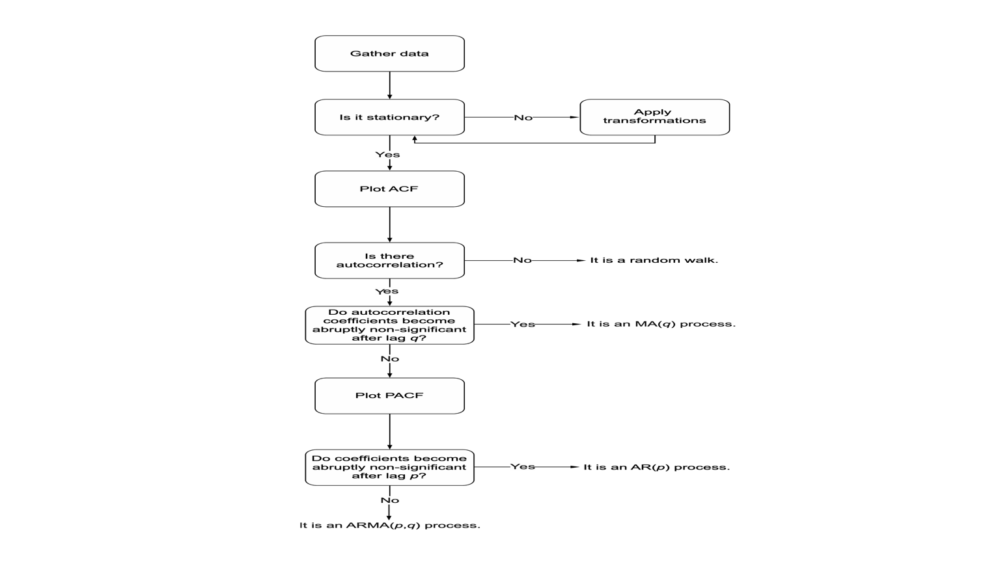
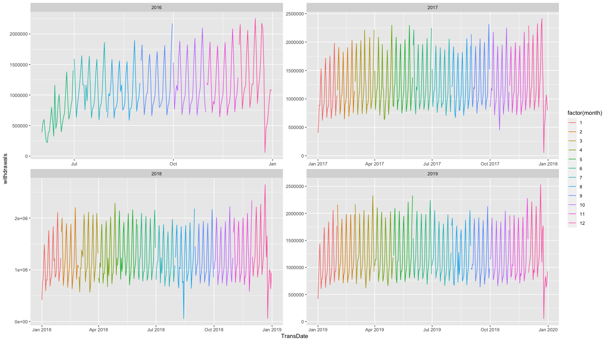
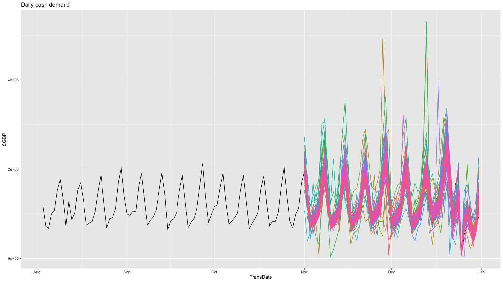

Cash Deman Forecast App
================

### Load Libraries

## Intoduction:

Steps to forecast Cash demand:

- Load Required Libraries: Load the required libraries for the script,
  including libraries for data manipulation, time series analysis, and
  plotting.
- Load Data: Load the data for the cash demand for ATM machines and
  create a summary of the data to check for missing values.
- Preprocessing: Convert the data frame to a tsibble format and check if
  the time series is complete by using the fill_gaps function. Also,
  fill any missing values in the time series data using the interpolate
  function.
- Visualize the Data: Plot the cash demand over the period of 2016 to
  2019 to get an idea of the trend.
- Seasonality Check: Use time series decomposition to check for
  seasonality in the cash demand data.
- Model Fitting: Fit a time series model, such as ARIMA, to the data and
  use it to forecast the future cash demand for each ATM machine.

In this note book we Forecast cash Demand for ATM machines. We have the
data for ATM machines from 01-06-2016 to 31-12-2019. the cash deman
column is represented by withdrawals. We see the summary of the data
below we have 24 missing values in withdrawals Column.

    #>    TransDate           withdrawals     
    #>  Min.   :2016-06-01   Min.   :  53260  
    #>  1st Qu.:2017-04-24   1st Qu.: 884290  
    #>  Median :2018-03-17   Median :1112400  
    #>  Mean   :2018-03-17   Mean   :1223807  
    #>  3rd Qu.:2019-02-07   3rd Qu.:1548090  
    #>  Max.   :2019-12-31   Max.   :2645900  
    #>                       NA's   :24

    #>  TransDate       withdrawals    
    #>  Mode :logical   Mode :logical  
    #>  FALSE:1309      FALSE:1285     
    #>                  TRUE :24

## Preprocessing

To forcast in r we need to transform our data frame to tsibble format
which id time series data format in r for formcasting. We use TransDate
column and date index and the key column as the Groups or categories
that we want to forecast.

Check if the time series is complete and fill the missing dates in the
dataframe. Fill_gaps feature makes it easy to find out the if there is
any missing date index and it fill those gaps with NA values.

    #>    TransDate           withdrawals     
    #>  Min.   :2016-06-01   Min.   :  53260  
    #>  1st Qu.:2017-04-24   1st Qu.: 884290  
    #>  Median :2018-03-17   Median :1112400  
    #>  Mean   :2018-03-17   Mean   :1223807  
    #>  3rd Qu.:2019-02-07   3rd Qu.:1548090  
    #>  Max.   :2019-12-31   Max.   :2645900  
    #>                       NA's   :24

Next, we fill any gaps in the time series data using the fill_gaps
function from the tsibble package. The code also adds year, month, and
day columns to the tsibble. The missing values in the data are then
replaced with regression (TSLM) values using the interpolate function.

    #>    TransDate           withdrawals     
    #>  Min.   :2016-06-01   Min.   :  53260  
    #>  1st Qu.:2017-04-24   1st Qu.: 885490  
    #>  Median :2018-03-17   Median :1123220  
    #>  Mean   :2018-03-17   Mean   :1223543  
    #>  3rd Qu.:2019-02-07   3rd Qu.:1537620  
    #>  Max.   :2019-12-31   Max.   :2645900

## Graph showing the cash demand over the period of 2016 to 2010

The series look good for forecasting and at first glance it looks
stationary. But to confirm we will use ADF and KPSS test

<!-- --> \##
Seasonality check

The graph below shows the time series decomposition of cash demand. The
basic idea behind seasonal decomposition is to separate the time series
into its underlying components by repeatedly applying a filter to the
data. One common method of seasonal decomposition is to use the
“additive” method, which assumes that the time series can be modeled as
the sum of three components.

<!-- --> From the
seasonality plot we see there is no evident trend in the series however
we can see a solid weekly seasonality pattern.

## Stationarity Tests

Lets perform ADF test to check for stationarity Adf test Null
hypothesis: Series is not stationary, Alternate hypothesis = Series is
stationary Kpss test Null hypothesis: Series is stationary, Alternate
hypothesis = Series is not stationary

    #> 
    #>  Augmented Dickey-Fuller Test
    #> 
    #> data:  final_data$withdrawals
    #> Dickey-Fuller = -9.2698, Lag order = 10, p-value = 0.01
    #> alternative hypothesis: stationary

    #> 
    #>  KPSS Test for Trend Stationarity
    #> 
    #> data:  final_data$withdrawals
    #> KPSS Trend = 0.52284, Truncation lag parameter = 7, p-value = 0.01

Adf test test is significant at 0.05% significance level and we can
reject null hypothesis that series is not stationary and accep that
series is stationary. Kpss test is also significant which says that the
we reject null hypothesis that series is stationary and accept that
series is non stationary. Null hypothesis for both of these tests are
opp

lets repeat both these tests for stationarity after taking first
difference .

    #> 
    #>  Augmented Dickey-Fuller Test
    #> 
    #> data:  df_diff$diff_with
    #> Dickey-Fuller = -13.014, Lag order = 10, p-value = 0.01
    #> alternative hypothesis: stationary

    #> 
    #>  KPSS Test for Trend Stationarity
    #> 
    #> data:  df_diff$diff_with
    #> KPSS Trend = 0.0069142, Truncation lag parameter = 7, p-value = 0.1

Now both of our tests show that differenced series is stationary. So
this tells us that our series is stationary at first difference. Lets
look at acf and pcg graphs to find out whether our series following an
ma or ar process or is it more complex.

<!-- -->

## ACF PCF plots

Now we will identify if our series follows an ar(p) or ma(q) or
arma(p,q) process. figure above shows steps of identifying whethere a
series follows an ar(p) or ma(q) or arma(p,q) process.

<!-- -->

ACF function finds autocorrelation of previous values to current (lagged
values). Plot of the ACF of shows how autocorrelation coefficients
slowly decrease. We do not see a sudden decay in ACF plot so our series
is not an MA(q) process but we do detect repeated constant significance
lags at lag7 which indicates that our series has weekly seasonality. the
process to identifying that the seies follows which process is given in
the plot above. We don’t see a sudden decay in PACF plot either. as we
can see significant correlations at lags, 1 to 6. Our series is an ARMA
series.

<!-- -->

We will use auto_arima function from the forecast package to identify
the best ARMA process and SARIMA process for our series.

    #> # A mable: 1 x 1
    #>                     sarima
    #>                    <model>
    #> 1 <ARIMA(1,0,1)(4,1,0)[7]>

Auto ARIMA has picked the model with ARIMA(1,0,1)(4,1,0) with weekly
seasonality.

A moving average process, or the moving average (MA) model, states that
the current value is linearly dependent on the current and past error
terms. The error terms are assumed to be mutually independent and
normally distributed, just like white noise. A moving average model is
denoted as MA(q), where q is the order. The model expresses the present
value as a linear combination of the mean of the series μ, the present
error term εt, and past error terms εt–q. The magnitude of the impact of
past errors on the present value is quantified using a coefficient
denoted as θq. Mathematically, we express a general moving average
process of order q as in equation. The equation for an MA(q) model is
defined as: Y(t) = μ + ε(t) + θ1ε(t-1) + θ2ε(t-2) + … + θqε(t-q) where:
Y(t) is the forecast for time period t μ is the mean of the time series
ε(t) is the error term at time period t θ1, θ2, …, θq are the parameters
of the model, also known as the MA coefficients, which are estimated
from the data.

The two graph below are showing trend in cash demand over 3 years and
demand looks very steady.

<!-- -->

## Test & Train Data

    #> [1] 61

We split the data into train and test set . The train set is the data
below 2019-11-01 and we will forecast for 61 days.

## Trainig Model

lets train a seasonal arima model, we can specify as follows and we can
tell the function to pick the best model from range of parameters we
will specify an ARIMA mdoel as follows: pdq(p = 0:5, d = 0:2, q = 0:5)
PDQ(P = 0:5, D = 0:1, Q = 0:5)

    #> # A mable: 1 x 1
    #>                     sarima
    #>                    <model>
    #> 1 <ARIMA(1,0,1)(4,1,0)[7]>

<!-- --> The
residual analysis shows that our model is good and acf plot shows very
few autocorrelation of residuals to its lags and its mostly white noise.
the histogram of residuals are also pretty much normaly distrubuted.

## Forecast vs Actual

<!-- --> The plot
above shows forecast in blue and black line shows the actual values. We
notice that model is underforecasting at the end of november and third
week of december and last of december is overforecasted which is due to
christmas and newyear period. Where the cash withdrawals become quite
low bcz people spend time with family or travel abroad.

Lets add another arima model with dummy variables to account for these
issues and see how our model performs.

## Train models

    #> # A mable: 1 x 2
    #>                             dummy_arima                   sarima
    #>                                 <model>                  <model>
    #> 1 <LM w/ ARIMA(1,0,0)(2,1,2)[7] errors> <ARIMA(1,0,1)(4,1,0)[7]>

Above we can see the selected ARIMA process for two models.

    #> # A tibble: 2 × 8
    #>   .model      sigma2 log_lik    AIC   AICc   BIC ar_roots   ma_roots  
    #>   <chr>        <dbl>   <dbl>  <dbl>  <dbl> <dbl> <list>     <list>    
    #> 1 dummy_arima 0.0247    536. -1040. -1040. -958. <cpl [15]> <cpl [14]>
    #> 2 sarima      0.0483    120.  -225.  -225. -189. <cpl [29]> <cpl [1]>

We can see that the dummy_arima model has lower AIC and AICs in
comparison of Two sarima model without dummy variables.

    #> # A tibble: 2 × 3
    #>   .model      lb_stat lb_pvalue
    #>   <chr>         <dbl>     <dbl>
    #> 1 dummy_arima  44.7    2.01e-10
    #> 2 sarima        0.990  6.10e- 1

ljun_box test shows high statistis 44.65 for dummy_arima means that our
model is good.

## best_model

<!-- -->

    #>   res_mean
    #> 1  28921.8

The time plot of the residuals shows that the variation of the residuals
stays much the same across the historical data. Therefore the residual
variance can be treated as constant. This can also be seen on the
histogram of the residuals. The histogram suggests that the residuals
are normal Consequently, forecasts from this method will probably be
quite good.

## Create data for forecast

<!-- --> Dummy
forecast shown in Red is much better than sarima forecast in Green and
it captures the last week of November and december much better compared
to sarima model without dummies.

    #> # A tibble: 2 × 2
    #>   .model         rmse
    #>   <chr>         <dbl>
    #> 1 dummy_arima 152271.
    #> 2 sarima      340813.

The error rmse is also way lower for dummy variable.

we can generate a new time series that are similar to the observed
series. To achieve this, we utilize a type of bootstrapping known as the
Box-Cox bootstrap.

The first step in the process is to transform the time series using the
Box-Cox transformation. This transformation helps to stabilize the
variance of the time series and make it more suitable for analysis.
Following the transformation, we decompose the time series into its
trend, seasonal, and remainder components using the STL (Seasonal and
Trend decomposition using Loess) method.

Once the decomposition is complete, we focus on generating new
variations of the remainder component. To do this, we cannot simply use
the re-draw procedure described in previous literature due to the
presence of autocorrelation in an STL remainder series. Instead, we
adopt a “blocked bootstrap” approach, where contiguous sections of the
time series are selected at random and joined together to create new
variations of the remainder component.

The resulting bootstrapped remainder series are then added to the trend
and seasonal components obtained from the STL decomposition. Finally,
the reverse Box-Cox transformation is applied to the result, giving us
new variations of the original time series.

In conclusion, our proposed method utilizes a combination of Box-Cox
transformation, STL decomposition, and blocked bootstrapping to generate
new time series that are similar to the observed series.

## create bootstraped seies 100 times

<!-- --> Now we
can forecast for all 100 bootstrap series with our tarined model and in
the end we can forecast using the average of all forecasts. the
resulting forecast can be seen below.

## Aggregated sim forecast

<!-- -->

    #> # A tibble: 1 × 1
    #>      rmse
    #>     <dbl>
    #> 1 155982.
